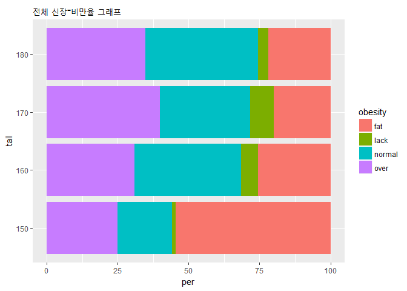
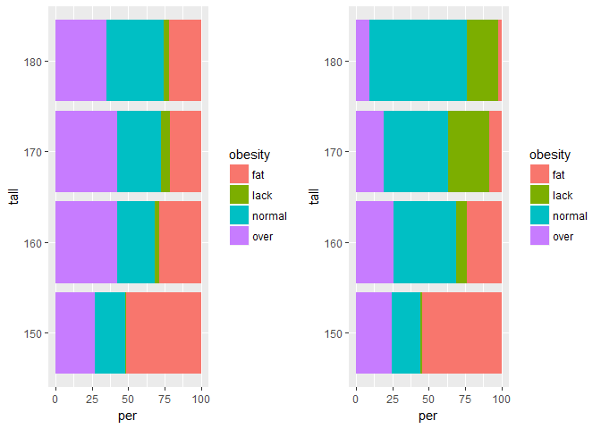
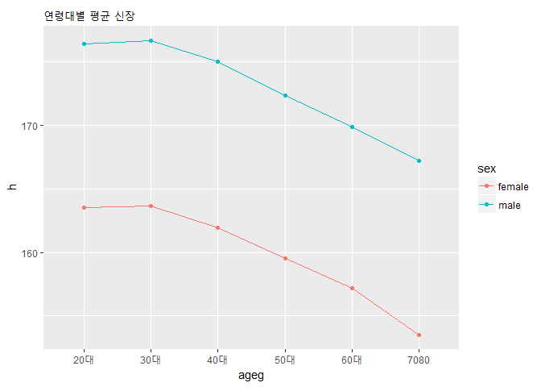
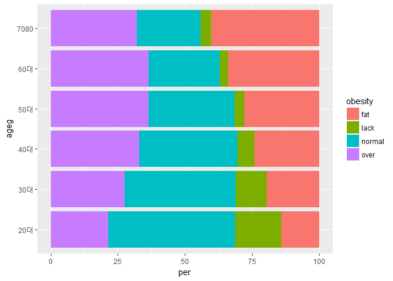
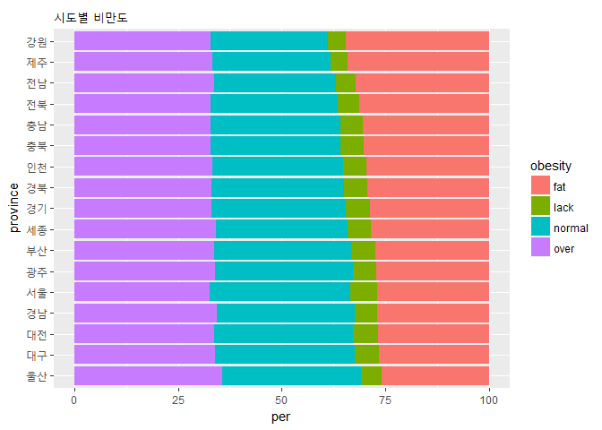
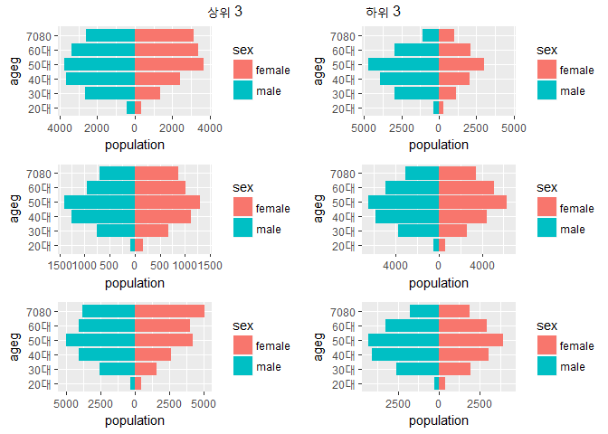

신체적 요인과 비만 분석
================

### 1. 서론

#### 1) 문제의식과 주제 선정 이유

전세계적으로 비만으로 인한 사회적 비용은 2조 달러로, 전쟁과 테러로 인한 사회적 비용(2.1조 달러)과 맘먹는 수치이다. 우리나라는 OECD회원국 중에서 비만율이 가장 낮은 국가[1]에 속해 있으나 이는 세계보건기구의 국제 비만 표준을 따라 계산했을 때의 이야기이며, 조금 더 까다로운 기준을 통해 자체적으로 비만도를 조사한 경우, 2016년 기준 성인의 약 35%가 비만이라는 결과가 나온다. 그렇기 때문에 정부 차원에서 비만문제에 대한 노력이 요구되는 것은 당연하다. 따라서 우리는 본 연구를 통해 비만이 가진 특징들을 알아보고 결과에 맞는 정책방향을 논의해보고자 한다. 비만이 각종 성인병의 원인이 되는 것은 이미 여러 연구를 통해 입증된 결과이기 때문에 본 연구에서는 비만이 질병과 관련된 상관관계를 파악하는 것은 배제하고, 신체 요인의 특징들을 살펴볼 예정이다.

#### 2) 데이터 선정과 주제

먼저 원자료로 국민건강보험공단에서 수집한 2015년 건강검진 데이터를 이용하였다. 여기서 신장과 체중 데이터를 이용하여 비만도를 구하고 비만율과 신장, 연령대 이렇게 세 변수의 관계가 서로 어떻게 나타나는지 파악한 후에 비만율을 통하여 시도별 평균 신장과 연령대를 추정해본다. 끝으로 파악한 비만율의 특징을 바탕으로 정부비만정책의 올바른 방향을 논하고자 한다. 분석에서 비만도는 'BMI 측정법[2]'이 아니라 '브로카(Broca) 지수'로 구하였다. 그 이유는 '브로카 지수'는 일반인도 쉽게 구할 수 있는 비만도 측정법이며, 'BMI 측정법'에서 비만의 기준값이 국제 표준과 우리나라 표준이 서로 다르기 때문에 혼란을 야기할 수 있어서이다.

### 2. 본론

#### 1) 데이터 변수 정리 및 결측치 확인

필요한 패키지와 데이터를 불러온 후에 코드의 안정성을 위해 가급적 영어를 이용하여 가독성을 높이는 작업을 실시하였다.

``` r
library(dplyr)
```

    ## 
    ## Attaching package: 'dplyr'

    ## The following objects are masked from 'package:stats':
    ## 
    ##     filter, lag

    ## The following objects are masked from 'package:base':
    ## 
    ##     intersect, setdiff, setequal, union

``` r
library(ggplot2)
raw_people <- read.csv("NHIS_OPEN_GJ_2015.csv")
people <- raw_people                                   # 원 자료로 복사본 만들기

# 변수명 설정
people <- rename(people,
               height = 신장.5Cm단위. ,
               weight = 체중.5Kg.단위. ,
               sex = 성별코드,
               province_num = 시도코드,
               age = 연령대코드.5세단위.)


# 시도코드 번호에 맞는 코드명을 데이터프레임에 입력
city <- data.frame(province_num = c(11, 26, 27, 28, 29, 30, 31, 36, 41, 42, 43, 44, 45, 46, 47, 48, 49),
                   province = c("서울","부산","대구","인천","광주","대전","울산","세종","경기","강원",
                                "충북","충남","전북","전남","경북","경남","제주"))

people <- left_join(people, city, by = "province_num")


people$sex <- ifelse(people$sex == 1, "male", "female")

people$tall <- ifelse(people$height >= 180, "180",
                    ifelse(people$height >= 170, "170",
                           ifelse(people$height >= 160, "160", "150")))

people$normal_height <- (people$height-100)*0.9           # 브로카 지수를 구하기 위해 먼저 표준체중을 구한다.

people$broca <- (people$weight/people$normal_height)*100    #브로카 지수를 구한다.

people$obesity <- ifelse(people$broca < 90, "lack",
                       ifelse(people$broca < 110, "normal",
                              ifelse(people$broca < 120, "over", "fat")))

people$ageg <- ifelse(people$age < 6, "20대",
                    ifelse(people$age < 8, "30대",
                           ifelse(people$age < 10, "40대",
                                  ifelse(people$age < 12, "50대",
                                         ifelse(people$age < 14, "60대", "7080")))))

find_na <- people %>%
  select(height, weight, ageg, province_num, sex)

table(is.na(find_na))
```

    ## 
    ##   FALSE 
    ## 4901275

원자료에는 시도코드가 나와 있으나 그에 맞는 코드명은 따로 코드북을 참고해야 알 수 있다. 따라서 시도코드에 맞는 코드명을 따로 데이터 프레임으로 만들어 left\_join 함수로 참조하였다. 비만의 기준이 되는 '브로카 지수' 값은 따로 표준체중을 구한 후 '키/표준체중\*100' 값으로 구한다. 비만율은 브로카 지수가 120이상일 때 "fat"으로 환산하였다. 세분화하면 1, 2, 3단계 비만까지 나눌 수 있으나 여기에서는 따로 구분을 짓지 않고 전체를 비만으로 통합하여 쓰기로 한다. 마지막으로 우리가 다룰 변수들의 변수명을 뽑아 결측치 여부를 확인했다.

#### 2) 개인의 비만도와 신장, 연령대의 상관관계

먼저 연령대별 신장에 따른 비만도 비율 그래프를 구해보자. 신장을 10cm 단위로 묶어서 4개의 그룹을 만든 후 서로 비교해본다. 그래프를 구하기 전에 우선 키가 크면 비만율이 적을 것이라는 가벼운 추측을 해본다.

``` r
#전체 관측치의 신장에 따른 비만율 그래프
people_height <- people %>%
  count(tall, obesity) %>% 
  group_by(tall) %>% 
  mutate(per = round(n/sum(n)*100, 2))


ggplot(data = people_height, aes(x = tall, y = per, fill = obesity)) +
  geom_col() +
  coord_flip() +
  ggtitle("전체 신장-비만율 그래프")
```



그러나 예상과는 다르게 키가 180cm 이상인 그룹의 비만율이 170cm 그룹보다 높게 나타난다. 또한 키가 160cm 미만인 사람들의 비만율이 50%가 넘을 정도로 높게 나타난다. 여기서 우리는 성별에 따른 신장 차이를 고려하여 비교분석해 볼 필요성을 느꼈다. 성별에 따른 신장 별 비만도 비율을 구하기 위해 'gridExtra' 패키지를 활용하여 두 그래프를 동시에 비교해보면 다음과 같다.

``` r
#install.packages("gridExtra")               # 패키지가 없다면 설치를 해야 한다.
library(gridExtra)                           # library로 패키지를 불러들인다.
```

    ## 
    ## Attaching package: 'gridExtra'

    ## The following object is masked from 'package:dplyr':
    ## 
    ##     combine

``` r
# 전체 관측치의 성별 신장 비율
# 남자 평균 신장에 따른 비만도 비율
male_people_height <- people %>%
  filter(sex == "male") %>% 
  count(tall, obesity) %>%
  group_by(tall) %>% 
  mutate(per = round(n/sum(n)*100, 2))

# 여자 평균 신장에 따른 비만도 비율
female_people_height <- people %>%
  filter(sex == "female") %>% 
  count(tall, obesity) %>%
  group_by(tall) %>% 
  mutate(per = round(n/sum(n)*100, 2))

# 그래프 합산
graph1 <- ggplot(data = male_people_height, aes(x = tall, y = per, fill = obesity)) +
  geom_col() +
  coord_flip()

graph2 <- ggplot(data = female_people_height, aes(x = tall, y = per, fill = obesity)) +
  geom_col() +
  coord_flip()

grid.arrange(graph1, graph2, ncol = 2)
```



남성의 경우 대체로 신장이 커질 수록 비만율이 작아진다고 말할 수 있지만, 여성은 확연하게 신장이 커질수록 비만율이 점차 줄어든다. 따라서 전반적으로 신장과 비만도는 어느 정도 음의 상관관계를 가지고 있는 모습이다.

그렇다면 연령대별 평균 신장은 어떻게 될까?

``` r
# 연령대별 평균 신장
ageg_mean_height <- people %>%
  group_by(ageg, sex) %>% 
  summarise(h = mean(height))
 
ggplot(data = ageg_mean_height, aes(x = ageg, y = h, group = sex, col = sex)) +
  geom_line() + 
  geom_point() +
  ggtitle("연령대별 평균 신장")
```



연령대가 높아질 수록 평균 신장은 낮아지므로 둘은 음의 상관관계를 갖는 것으로 확인할 수 있다. 앞서 신장이 비만도와도 관련이 있었기 때문에, 연령대와 비만율은 서로 관계가 있을 것이라고 추정할 수 있다. 신장과 연령대의 관계는 신장과 비만율의 관계와 마찬가지로 음의 관계를 가지고 있기 때문에 연령대와 비만율의 관계는 양의 관계를 가지고 있을 것이라 가정하고 둘의 관계를 구하면 다음과 같다.

``` r
# 연령대에 따른 비만도 비율
ageg_obesity_ratio <- people %>%
  count(ageg, obesity) %>% 
  group_by(ageg) %>% 
  mutate(per = round(n/sum(n)*100, 2))

ggplot(data = ageg_obesity_ratio, aes(x = ageg, y = per , fill = obesity)) +
  geom_col() +
  coord_flip()
```



예상한 대로 비만은 평균 신장이 낮은 고연령대에게서 두드러지게 나타나는 결과이다. 우리는 이를 통해 지역별 비만도를 보고 평균 신장과 연령대를 추정해볼 수 있을 것이다.

#### 3) 시도별 비만도와 신장, 연령대 추정

시도별 비만율을 알고 있을 때, 비만율이 높은 지역에서는 평균 신장이 낮으면서 연령대가 높게 나타날 것이고 비만율이 낮은 지역은 이와 정반대의 결과가 나타날 것이라는 예상을 할 수 있다. 먼저 지역별 비만도를 구하고 비만율이 높은 순서대로 정렬하면 다음과 같다.

``` r
# 시도별 비만 높은 순
city_range <- people %>% 
  count(province, obesity) %>% 
  group_by(province) %>% 
  mutate(per = round(n/sum(n)*100, 2))

list_order <- city_range %>% 
  filter(obesity == "fat") %>% 
  arrange(per)

order <- list_order$province

ggplot(data = city_range, aes(x = province, y = per, fill = obesity)) +
  geom_col() +
  coord_flip() +
  scale_x_discrete(limits = order) +
  ggtitle("시도별 비만도")
```



비만율이 가장 높은 강원은 약 33% 정도로 나타나고 있으며 울산은 약 25% 정도의 비만율을 보이고 있다. 그렇다면 우리는 다음과 같이 가설을 설정할 수 있다.

    1. 비만율이 높은 지역이 낮은 지역보다 평균 신장이 낮다. 
    2. 비만율이 높은 지역이 낮은 지역보다 연령대가 높은 사람들의 비중이 클 것이다.

두 가설이 참이라면 강원도의 평균 신장이 낮고, 고연령대의 인구가 많을 것이다. 반면에 울산은 평균 신장이 높으면서 고연령대 비중이 낮을 것이다. 가설 검정을 하기 위해서 먼저 지역별 평균 신장을 확인하면 다음과 같다.

``` r
# 시도별 남성 평균 신장
people %>%
  filter(sex == "male") %>% 
  group_by(province) %>% 
  summarise(mean_height = mean(height))
```

    ## # A tibble: 17 x 2
    ##    province mean_height
    ##    <fct>          <dbl>
    ##  1 강원            172.
    ##  2 경기            173.
    ##  3 경남            173.
    ##  4 경북            172.
    ##  5 광주            173.
    ##  6 대구            173.
    ##  7 대전            173.
    ##  8 부산            173.
    ##  9 서울            173.
    ## 10 세종            173.
    ## 11 울산            173.
    ## 12 인천            173.
    ## 13 전남            172.
    ## 14 전북            172.
    ## 15 제주            172.
    ## 16 충남            172.
    ## 17 충북            172.

``` r
# 시도별 여성 평균 신장
people %>%
  filter(sex == "female") %>% 
  group_by(province) %>% 
  summarise(mean_height = mean(height))
```

    ## # A tibble: 17 x 2
    ##    province mean_height
    ##    <fct>          <dbl>
    ##  1 강원            158.
    ##  2 경기            159.
    ##  3 경남            159.
    ##  4 경북            158.
    ##  5 광주            160.
    ##  6 대구            159.
    ##  7 대전            160.
    ##  8 부산            159.
    ##  9 서울            160.
    ## 10 세종            159.
    ## 11 울산            160.
    ## 12 인천            159.
    ## 13 전남            158.
    ## 14 전북            158.
    ## 15 제주            159.
    ## 16 충남            158.
    ## 17 충북            158.

안타깝게도 시도별 평균 신장은 남성이 1cm 이내, 여성이 2cm 이내의 차이를 보이며 큰 격차를 보이지 않는다. 이 정도의 평균 신장 차이로 비만도를 추정하는 시도는 무의미하며 충분한 조건도 이루어지지 않는다. 따라서 비만율이 키를 설명하는 부분이 양의 관계가 있지만, 그 영향력은 굉장히 작고, 신장을 설명하는 다른 변수의 요인이 크다고 말할 수 있다.

그렇다면 비만도를 이용하여 연령대를 추정한 결과는 어떨까? 비만율 상위 3개 지역과 하위 3개 지역의 인구를 비교해보면 다음과 같다.

``` r
# 비만율 상위 3개 지역의 인구 분포도
# 강원
Gangwon <- people %>%
  filter(province == "강원") %>% 
  group_by(ageg, sex) %>% 
  summarise(population = n())


Gangwon_praph <- ggplot(data = Gangwon, 
       mapping = aes(x = ageg, fill = sex, 
                     y = ifelse(test = sex == "male", 
                                yes = -population, no = population))) +
  geom_bar(stat = "identity") +
  scale_y_continuous(labels = abs, limits = max(Gangwon$population) * c(-1,1)) +
  labs(y = "population") +
  coord_flip()

# 제주
Jeju <- people %>%
  filter(province == "제주") %>% 
  group_by(ageg, sex) %>% 
  summarise(population = n())


Jeju_graph <- ggplot(data = Jeju, 
       mapping = aes(x = ageg, fill = sex, 
                     y = ifelse(test = sex == "male", 
                                yes = -population, no = population))) +
  geom_bar(stat = "identity") +
  scale_y_continuous(labels = abs, limits = max(Jeju$population) * c(-1,1)) +
  labs(y = "population") +
  coord_flip()

# 전남
Jeonnam <- people %>%
  filter(province == "전남") %>% 
  group_by(ageg, sex) %>% 
  summarise(population = n())

Jeonnam_graph <- ggplot(data = Jeonnam, 
       mapping = aes(x = ageg, fill = sex, 
                     y = ifelse(test = sex == "male", 
                                yes = -population, no = population))) +
  geom_bar(stat = "identity") +
  scale_y_continuous(labels = abs, limits = max(Jeonnam$population) * c(-1,1)) +
  labs(y = "population") +
  coord_flip()


# 비만율 하위 3개 지역의 인구 분포도
# 울산
Ulsan <- people %>%
  filter(province == "울산") %>% 
  group_by(ageg, sex) %>% 
  summarise(population = n())


Ulsan_graph <- ggplot(data = Ulsan, 
       mapping = aes(x = ageg, fill = sex, 
                     y = ifelse(test = sex == "male", 
                                yes = -population, no = population))) +
  geom_bar(stat = "identity") +
  scale_y_continuous(labels = abs, limits = max(Ulsan$population) * c(-1,1)) +
  labs(y = "population") +
  coord_flip()

# 대구
Daegu <- people %>%
  filter(province == "대구") %>% 
  group_by(ageg, sex) %>% 
  summarise(population = n())


Daegu_graph <- ggplot(data = Daegu, 
       mapping = aes(x = ageg, fill = sex, 
                     y = ifelse(test = sex == "male", 
                                yes = -population, no = population))) +
  geom_bar(stat = "identity") +
  scale_y_continuous(labels = abs, limits = max(Daegu$population) * c(-1,1)) +
  labs(y = "population") +
  coord_flip()

# 대전
Daegeon <- people %>%
  filter(province == "대전") %>% 
  group_by(ageg, sex) %>% 
  summarise(population = n())


Daegeon_graph <- ggplot(data = Daegeon, 
       mapping = aes(x = ageg, fill = sex, 
                     y = ifelse(test = sex == "male", 
                                yes = -population, no = population))) +
  geom_bar(stat = "identity") +
  scale_y_continuous(labels = abs, limits = max(Daegeon$population) * c(-1,1)) +
  labs(y = "population") +
  coord_flip()

# 그래프 합산
grid.arrange(Gangwon_praph, Ulsan_graph, Jeju_graph, Daegu_graph, Jeonnam_graph, Daegeon_graph, ncol = 2, 
             top = "상위 3                                  하위 3")
```



그림에서 상위 3개 지역은 위쪽부터 강원, 제주, 전남이며 하위 3개 지역은 위쪽부터 울산, 대구, 대전이다. 그림에서 제주와 대구는 별 차이가 나지 않는 것처럼 보인다. 결과적으로 70대 이상의 연령대의 비중이 약 4% 정도 더 큰데, 이것이 하나의 요인으로 작용하는 것으로 보인다. 결론적으로 비만율이 높은 지역에서 고연령대의 비중이 큰 것으로 나타난다. 이는 지역별 비만율에 따라 연령대 추적이 가능한 것으로 보인다. 따라서 '비만율이 높은 지역이 낮은 지역보다 평균 신장이 낮다'는 가설 1은 기각하며, '비만율이 높은 지역이 낮은 지역보다 연령대가 높은 사람들의 비중이 클 것이다'는 가설 2는 유의하다고 볼 수 있다.

### 3. 결론

우리는 개인의 비만도와 신장, 연령대라는 세 변수가 서로 상관관계가 있음을 확인했다. 개인의 비만율은 신장과는 서로 반대(음의 상관관계)되며 연령대와는 일치(양의 상관관계)하는 모습을 보이고 있다. 이를 바탕으로 시도별 비만도를 통해 신장, 연령별 특징을 가설 설정하고 추정해보았다. 결과적으로 지역별 비만도를 통해 평균 신장은 예측할 수 없었으나, 고연령대의 인구 비중이 크다는 것은 적절하게 예측할 수 있었다. 따라서 비만복지정책의 한 방향으로 연령대가 높은 지역에서는 비만정책지원도 같이 이루어져야 한다. 물론 지역별 비만인구가 비율이 아닌 인구 숫자에 따라 진행해야 하는 부분도 고려해야겠으나, 비만율 상위 세 군데 모두 교통이 불편한 지역이라는 점이 눈에 띈다. 아마 교통 때문에 의료복지 서비스를 제대로 받지 못할 위치에 놓은 노령층이 많기 때문에 비만율이 높게 나오는 게 아닐까 하는 추측을 해본다. 따라서 '찾아가는 주민센터'처럼 '찾아가는 비만의료복지' 서비스가 고연령대가 많은 지역을 중심으로 생겨나야 한다는 의견을 내본다.

### 4. 논의점

한계와 추후 분석 방향 :

인바디와 같은 체성분 검사가 아닌 신장, 체중으로만 이루어지는 모든 측정법은 사실 완전한 체지방률을 검사할 수 없다. 따라서 수치가 크다고 해서 비만인지 아닌지 정확하게 구분할 수는 없다. 다만 오랜 사용끝에 확률 상 유의하기 때문에 약간의 편법으로 구하는 방식이다. 신장과 비만율의 상관관계를 나타낸 그래프에서 유독 키가 작은 사람의 비만율이 높은 경향을 보이는 원인이기도 하다.

또한 연령과 신장, 체중이 모두 5 단위인 점에서 평균의 한계를 느낀다. 키가 160 ~ 164(cm)인 사람들은 전부 160으로 환산되었다. 다시말해 값이 내림값으로 들어갔다는 이야기인데, 평균보다 낮은 수치의 결과가 나왔을 확률을 배제할 수 없다. 제주와 대구를 놓고 비교해보았을 때, 평균 연령은 비슷해 보이나 전체 비만율이 크게 차이가 나는 것이 이와 관련한 문제라고 할 수 있다. 끝으로 성별, 신장, 체중 등 생물학적 요인들로만 비만율을 구하였는데, 이 외에 다른 요인들을 통해 비만도를 분석할 수 있는 자료가 있으면 좋겠다.

------------------------------------------------------------------------

[1] OECD의 '비만 업데이트 2017' 통계에서 우리나라는 15세 이상의 비만율이 일본(3.7%) 다음으로 낮은 수치인 5.3%를 기록하고 있다.

[2] 비만도를 측정하는 방법 중 하나로 '체중(kg)/신장(m)^2'의 값이 30 이상일 경우 국제 표준에서 비만이며 우리나라의 경우 25 이상일 때 비만으로 표기한다.
